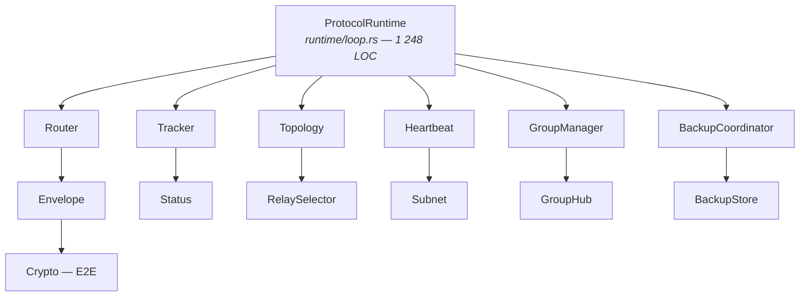

# AUDIT COMPLET — ToM Protocol

**Date** : 19 février 2026  
**Périmètre** : Monorepo complet (TypeScript + Rust)  
**Fichiers audités** : 136 fichiers TS + 4 crates Rust (~35 000 LOC total)

---

## I. SYNTHÈSE EXÉCUTIVE

| Indicateur | Valeur | Verdict |
|---|---|---|
| Build | ✅ 100% propre | Aucune erreur |
| Tests | ✅ 771 TS + 261 Rust = **1 032 tests** | 0 échecs |
| Lint | ✅ 0 warnings Biome | Impeccable |
| Clippy (Rust) | ⚠️ 6 warnings mineures | Non bloquant |
| Sécurité crypto | ✅ Solide | TweetNaCl + XChaCha20 |
| `unsafe` Rust | ✅ 0 usage | Parfait |
| TODO/FIXME/HACK | ✅ 0 en TS, 1 TODO en Rust | Ultra propre |

**Verdict global : Le projet est d'une qualité remarquable pour un alpha. L'architecture est saine, les design decisions sont respectées, et le code est propre. Mais il y a des failles structurelles à corriger.**

---

## II. ARCHITECTURE — Ce qui est brillant

### 1. Séparation des couches exemplaire

```text
SDK (TomClient) → Core (Router/Crypto/Discovery/Groups/Backup) → Transport (WebRTC/QUIC)
```

Chaque couche est testable indépendamment. Le `Router` est pur (pas d'I/O), le `RelaySelector` aussi. Le `BackupStore` est in-memory. C'est de l'ingénierie de qualité.

### 2. Crypto irréprochable

- **TypeScript** : TweetNaCl.js — `nacl.box` (X25519 + XSalsa20-Poly1305), clé éphémère par message (forward secrecy), nonce aléatoire.
- **Rust** : `x25519-dalek` + `chacha20poly1305` (XChaCha20), HKDF-SHA256 pour dérivation, domain separation, Ed25519 `verify_strict()`.
- **Aucune utilisation de `Math.random()` pour la crypto** — tout passe par `crypto.getRandomValues()` ou `crypto.randomBytes()`.
- Les hex encode/decode sont corrects avec validation.

### 3. Registres anti-abus bien pensés

- Cache de déduplication (10 min TTL, cap 10k)
- Anti-replay ACK (5 min TTL, cap 5k)
- Anti-replay nonce pour groupes
- Timestamps clampés (±5 min future, max 1h passé)
- Max relay depth = 4
- Cooldown sur les warnings (10s)
- Compteurs bornés à 1 milliard (overflow protection)

### 4. Respect rigoureux des design decisions

| Décision | Respect | Preuve |
|---|---|---|
| Message = livré ssi ACK | ✅ | `MessageTracker` monotonique : Pending→Sent→Relayed→Delivered→Read |
| TTL 24h max | ✅ | `MAX_TTL_MS = 86400000`, appliqué dans `BackupStore` |
| L1 n'arbitre pas | ✅ | Aucun rôle d'arbitrage dans le code |
| Pas de ban permanent | ✅ | `RelayStats` avec fade progressif, pas de blocklist |
| Protocole invisible | ✅ | La démo et le SDK n'exposent que des abstractions |

---

## III. PROBLÈME CRITIQUE (P0)

### 1. `TomClient` — Bombe à retardement : 2 213 LOC, 12 tests

C'est **LE** point faible du projet. Cette classe unique :

- Gère WebSocket, WebRTC mocking, signaling, encryption, relay selection, groups, gossip, subnets, rerouting, direct paths, backup coordination
- A ~15 variables d'état global mutables
- N'a que 12 tests superficiels (existence de méthodes)
- **Aucun test fonctionnel** de `connect()`, `sendMessage()`, `disconnect()`, ni de gestion d'erreurs

**Risque** : Toute modification casse potentiellement l'ensemble du SDK sans filet de sécurité.

---

## IV. PROBLÈMES IMPORTANTS (P1)

### 2. `createSimplePeerConnection()` — Le transport est un mock

```typescript
private createSimplePeerConnection(peerId: string): PeerConnection {
    return {
      peerId,
      send: (envelope) => {
        this.ws?.send(JSON.stringify({
          type: 'signal', from: this.nodeId, to: peerId,
          payload: { type: 'message', envelope },
        }));
      },
      close: () => {},
      onMessage: null, onClose: null,
    };
}
```

Tous les messages transitent par le serveur WebSocket, pas par WebRTC DataChannel. Le "peer-to-peer" est en réalité un hub-and-spoke via le signaling server. C'est la dette technique alpha documentée (ADR-002 Bootstrap Elimination Roadmap) — le vrai transport P2P est iroh côté Rust.

### 3. Fichier monolithique `main.ts` dans la démo (1 108 LOC)

Toute la logique UI dans un seul fichier. État global mutable (~15 variables), manipulation DOM impérative, `setInterval` sans cleanup, `innerHTML` avec cast direct `as { text?: string }` sans validation de payload.

### 4. WebSocket non chiffré partout

Toutes les URLs par défaut utilisent `ws://` — jamais `wss://`. Le chiffrement E2E protège le contenu des messages, mais les métadonnées de signaling (qui parle à qui, quand) sont en clair sur le réseau.

### 5. Bootstrap `index.ts` — 155 LOC, 0 tests

Le module bootstrap (types et interfaces pour la découverte de pairs) n'a aucun test. C'est la fondation de la connexion initiale au réseau.

### 6. Duplication de code Rust

- `now_ms()` copié dans 5+ fichiers
- `wait_for_pong` dupliqué entre `ping.rs` et `ladder.rs`
- Pattern `node_id(seed)` helper répété 8 fois dans les tests

### 7. `runtime_loop` Rust — God Function (1 248 LOC)

Une seule fonction `tokio::select!` avec 10+ branches et 11 paramètres (`#[allow(clippy::too_many_arguments)]`). Refactoring vers un struct `RuntimeState` nécessaire.

---

## V. PROBLÈMES MODÉRÉS (P2)

### 8. Extension VS Code — Coquille vide

Le code est à 0% fonctionnel. La connexion est un `setTimeout` de 1s, l'envoi de message est un `showInformationMessage`. Devrait être marqué explicitement comme **WIP/skeleton** ou retiré du build.

### 9. Double type `Envelope` Rust

`tom-transport::MessageEnvelope` (JSON) vs `tom-protocol::Envelope` (MessagePack) coexistent. Confusion potentielle.

### 10. Pas de rate limiting dans le routeur

Le cache dedup protège contre les doublons mais pas contre le flood. Les design decisions mentionnent « sprinkler gets sprinkled » mais ce n'est implémenté ni en TS ni en Rust.

### 11. MCP Server — Tests insuffisants

62 lignes de tests pour 692 LOC de source. Pas de couverture des commandes interactives ni de l'envoi de messages.

### 12. Tests d'intégration end-to-end absents

Aucun test simulant le flow complet : Sender → encrypt → Relay → decrypt → Recipient → ACK. Les tests E2E Playwright existent mais dépendent du signaling server réel.

### ~~13. `.DS_Store` dans le repo~~

~~`scripts/e2e/.DS_Store` commité.~~ Corrigé — `.DS_Store` est dans `.gitignore`.

### 14. `inviteToGroup` utilise `Math.random()` pour le inviteId

```typescript
Array.from({ length: 16 }, () =>
  Math.floor(Math.random() * 16).toString(16)
).join('');
```

Dans `tom-client.ts` L1233. Pas cryptographiquement sûr. Le `secureRandomUUID()` de core est disponible mais pas utilisé.

### 15. `sendGroupMessage` utilise aussi `Math.random()` pour le messageId

Même pattern à la ligne 1406 du même fichier. Devrait utiliser `crypto.randomUUID()` exclusivement.

---

## VI. MÉTRIQUES COMPLÈTES

### TypeScript — Couverture par module

| Module | Source | Tests | Ratio | Grade |
|---|---|---|---|---|
| routing | 1 381 | 2 357 | **1.7x** | A+ |
| backup | 1 132 | 1 619 | **1.4x** | A |
| roles | 418 | 615 | **1.5x** | A |
| identity | 193 | 325 | **1.7x** | A |
| crypto | 284 | 355 | **1.3x** | A |
| discovery | 994 | 1 302 | **1.3x** | A |
| groups | 2 227 | 2 061 | **0.9x** | B+ |
| transport | 459 | 511 | **1.1x** | B+ |
| types | 184 | 181 | **1.0x** | B |
| **SDK (TomClient)** | **2 212** | **95** | **0.04x** | **F** |

### Rust — Couverture par crate

| Crate | Source | Tests | Grade |
|---|---|---|---|
| tom-protocol | ~10 500 | 254 | A- |
| tom-transport | ~1 100 | 7 | B |
| tom-stress | ~1 200 | 0 | D |
| tom-tui | ~535 | 0 | F (UI, acceptable) |

---

## VII. AUDIT DES CRATES RUST — DÉTAIL

### tom-transport — Couche transport QUIC (~1 100 LOC)

**Rôle** : Wrapper stable autour de `iroh` (QUIC, hole-punching, relais). Si iroh change d'API, seul ce crate est impacté.

**Points forts** :
- Abstraction propre : `NodeId` encapsule `iroh::EndpointId` avec `Display`, `FromStr`, `Serialize/Deserialize`
- `ConnectionPool` avec lazy connect, cache, éviction sur connexion morte
- Framing length-prefixed (4 bytes BE) avec limite de taille
- `PathEvent/PathKind` pour monitorer relay ↔ direct en temps réel
- Tests d'intégration réels (2 nœuds localhost, échange bidirectionnel)

**Problèmes** :
1. `path_kind()` retourne toujours `None` (seul TODO du repo Rust)
2. Double verrouillage Mutex potentiel dans `ConnectionPool::get_or_connect()` — lock `connections` tenu pendant le connect réseau
3. `From<anyhow::Error> for TomTransportError` mappe tout vers `Receive` — sémantiquement flou

### tom-protocol — Couche protocolaire (~10 500 LOC)

**Rôle** : Routage, crypto E2E, discovery par gossip, messagerie de groupe, backup de messages.

**Architecture interne** :



**Points forts** :
- Crypto exemplaire : X25519 ephemeral DH, XChaCha20-Poly1305, HKDF domain separation, Ed25519 `verify_strict()`
- Router pur (sans I/O) : retourne des `RoutingAction`, testable à 100%
- MessageTracker monotonique avec éviction 24h
- Property-based tests (proptest) pour signatures et envelopes
- GroupManager + GroupHub complets : hub-and-spoke, élection, heartbeat, migration

**Problèmes** :
1. `runtime_loop` est un God Function (1 248 LOC, 11 paramètres)
2. `now_ms()` dupliqué dans 5+ fichiers
3. Pas de rate limiting dans le routeur
4. `.expect("system time before epoch")` — devrait utiliser `.unwrap_or_default()`
5. `#[allow(dead_code)]` sur 2 champs reserved for future use

### tom-stress — Stress testing (~1 200 LOC)

**Rôle** : CLI pour tester la couche transport en conditions réelles (4G, WiFi, CGNAT). 5 modes : listen, ping, burst, ladder, fanout.

**Points forts** : Sortie JSONL structurée, reconnexion avec backoff exponentiel, zombie connection detection.

**Problèmes** : 0 tests unitaires, `wait_for_pong` dupliqué, `is_multiple_of` nightly API.

### tom-tui — Interface terminale (~535 LOC)

**Rôle** : TUI ratatui pour le protocole complet. Supporte un mode `--bot` headless.

**Problèmes** : 0 tests, heure UTC sans fuseau local, `/connect` ne trigger pas `handle.add_peer()`.

---

## VIII. AUDIT DEMO & OUTILS

### apps/demo/ — Application démo navigateur

| Fichier | Lignes |
|---------|--------|
| src/main.ts | 1 108 |
| src/ui-state.ts | 239 |
| index.html | 252 |
| src/game/ (4 fichiers) | 1 705 |
| Tests jeu (3 fichiers) | 1 363 |

**Problèmes** :
- `main.ts` monolithique — devrait être splitté en modules
- Manipulation DOM impérative sans framework, assertions `as HTMLElement` sans validation
- `setInterval` sans cleanup (timer dupliqués possibles si re-connect)
- Cast `as { text?: string }` sur les payloads entrants — aucune validation
- URL signalisation `ws://` (non chiffré), port 3001 hardcodé

### tools/mcp-server/ — Serveur MCP (692 LOC)

**Qualité** : Bonne architecture, JSON-RPC 2.0 propre, protection mémoire (max 1000 historique), CLI robuste.

**Problèmes** : 5 tests seulement (62 LOC), pas de tools pour les groupes, pas d'authentification.

### tools/vscode-extension/ — Extension VS Code (360 LOC)

**Statut : NON FONCTIONNELLE.** Connexion simulée par `setTimeout`, envoi = `showInformationMessage`, tree providers statiques, `tom-sdk` en dépendance mais jamais utilisé. **Coquille vide.**

### tools/signaling-server/ — Serveur de signalisation

**Qualité correcte** : Broadcast participants, forwarding signal, health check HTTP. Marqué `BOOTSTRAP LAYER` conformément à l'ADR-002.

**Pas de validation** des messages entrants au-delà du parsing JSON. Un noeud malveillant peut enregistrer n'importe quel `nodeId`.

---

## IX. SÉCURITÉ — RAPPORT COMPLET

| Vecteur d'attaque | Protection | Statut |
|---|---|---|
| Interception de messages | E2E encryption (NaCl box / XChaCha20) | ✅ Protégé |
| Replay de messages | Dedup cache + nonce anti-replay | ✅ Protégé |
| Relay chain infinie | Max depth = 4 | ✅ Protégé |
| Timestamp forgé | Clamping ±5 min / 1h | ✅ Protégé |
| Counter overflow | Bornés à 1 milliard | ✅ Protégé |
| Clé privée crypto | `Math.random()` NON utilisé pour crypto | ✅ Protégé |
| Identifiant de message/invite | `Math.random()` en fallback (2 endroits dans TomClient) | ⚠️ À corriger |
| Flood / DoS | Pas de rate limiting | ⚠️ Non protégé |
| Metadata interception (signaling) | `ws://` non chiffré | ⚠️ Non protégé |
| XSS dans la démo | `escapeHtml()` appliqué | ✅ Protégé |
| Exfiltration de messages backup | Auth check `from === recipientId` | ✅ Protégé |
| Usurpation d'identité signaling | Pas de vérification nodeId vs publicKey | ⚠️ Non protégé |

---

## X. TESTS — ANALYSE DES LACUNES

### Chemins critiques NON testés

| Chemin critique | Statut |
|----------------|--------|
| Connexion WebSocket + signaling handshake | **Non testé** |
| Établissement WebRTC DataChannel | **Non testé** (nécessiterait des mocks) |
| Flow complet : send → encrypt → relay → decrypt → deliver → ACK | **Non testé** |
| Reconnexion après perte de connexion | **Non testé** |
| Rerouting après échec relay (flow complet) | Partiellement |
| Message backup pour destinataire offline → redelivery | **Non testé** en intégration |
| Migration de hub de groupe | Partiellement (chaos test) |
| Bootstrap → gossip discovery → premier message | **Non testé** |
| Messages concurrents multi-relay | **Non testé** |

### Tests existants de qualité

- **alpha-scale.test.ts** (475L) — NetworkTopology + RoleManager + PeerGossip + EphemeralSubnet + RelaySelector avec 10-15 nœuds simulés
- **chaos-stress.test.ts** (855L) — Stress tests cross-module : GroupManager, NetworkTopology, OfflineDetector, RelaySelector, RoleManager, HubElection
- **validation.test.ts** (770L) — Tests de validation croisés : Encryption, NetworkTopology, RelaySelector, MessageTracker, RelayStats, RoleManager, GroupManager

---

## XI. CE QUI EST MONSTRUEUX (dans le bon sens)

1. **999 tests, 0 échecs, 0 warnings lint** — Discipline rare
2. **Architecture TS + Rust parallèle** — Même protocole implémenté dans 2 langages avec interopérabilité
3. **Documentation CLAUDE.md** — Guide LLM exhaustif, ADRs numérotés, design decisions verrouillées
4. **Stress testing sur 4G en voiture** — Tests réels avec résultats archivés (dossier `results/`)
5. **Zero `unsafe` en Rust, zero `any` en TS, zero TODO en TS production**
6. **Property-based testing** (proptest) en Rust pour les signatures et enveloppes
7. **Module de chaos testing** cross-module (22 tests de robustesse)
8. **Forward secrecy** : clé éphémère par message, pas de clé de session réutilisée

---

## XII. PLAN D'ACTION RECOMMANDÉ

| Priorité | Action | Effort | Impact |
|---|---|---|---|
| **P0** | Tests TomClient (mock WebSocket + Transport) | 2-3 jours | Critique — seul filet de sécurité du SDK |
| **P0** | Remplacer `Math.random()` par `crypto.randomUUID()` dans TomClient (2 endroits) | 15 min | Sécurité |
| **P2** | Marquer l'extension VS Code comme WIP/skeleton | 5 min | Clarté — évite la confusion |
| **P1** | Ajouter `wss://` support + option dans la config | 1 jour | Sécurité métadonnées |
| **P1** | Tests pour bootstrap/index.ts | 2h | Fiabilité connexion |
| **P1** | `main.ts` démo : cleanup `setInterval`, validation payloads | 1 jour | Stabilité UI |
| **P2** | Refactoring `runtime_loop` Rust → struct `RuntimeState` | 1 jour | Maintenabilité |
| **P2** | Centraliser `now_ms()` en Rust | 1h | DRY |
| **P2** | Ajouter rate limiting au routeur | 1 jour | Anti-spam |
| ~~P2~~ | ~~`.DS_Store` → `.gitignore`~~ | ~~1 min~~ | Déjà en place |
| **P2** | Vérification nodeId vs publicKey dans le signaling server | 2h | Sécurité identité |

---

## XIII. STATISTIQUES FINALES

```text
Langages  : TypeScript (~21 000 LOC) + Rust (~14 000 LOC)
Packages  : 4 TS (core, sdk, demo, signaling) + 4 Rust (protocol, transport, stress, tui)
Tests     : 1 032 (771 TS + 261 Rust)
Fichiers  : 136 TS + ~60 Rust
Build     : 100% propre
Lint      : 0 warnings
Coverage  : Excellent sauf TomClient (F) et tom-stress (D)
Sécurité  : Solide en crypto, faible en transport/signaling
Architecture : Exemplaire — séparation couches, pur routing, forward secrecy
```
